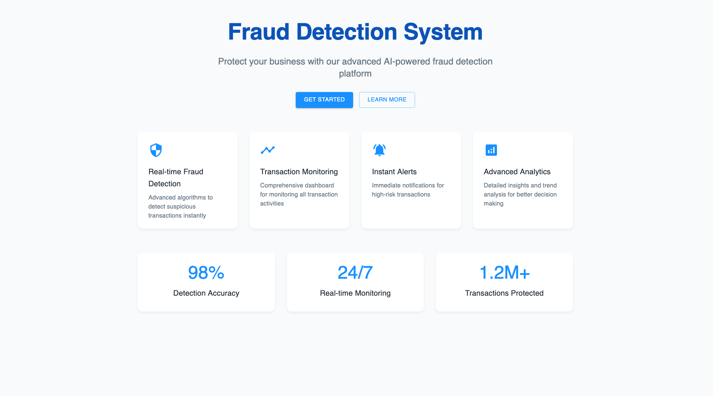
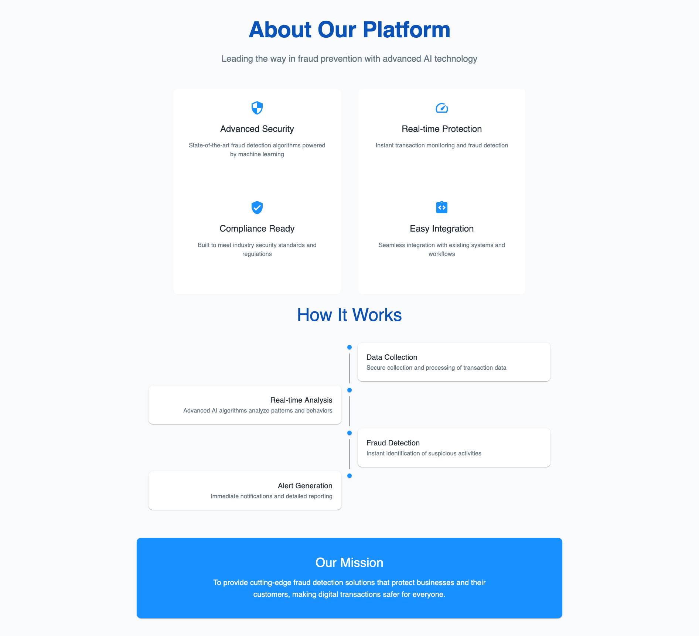
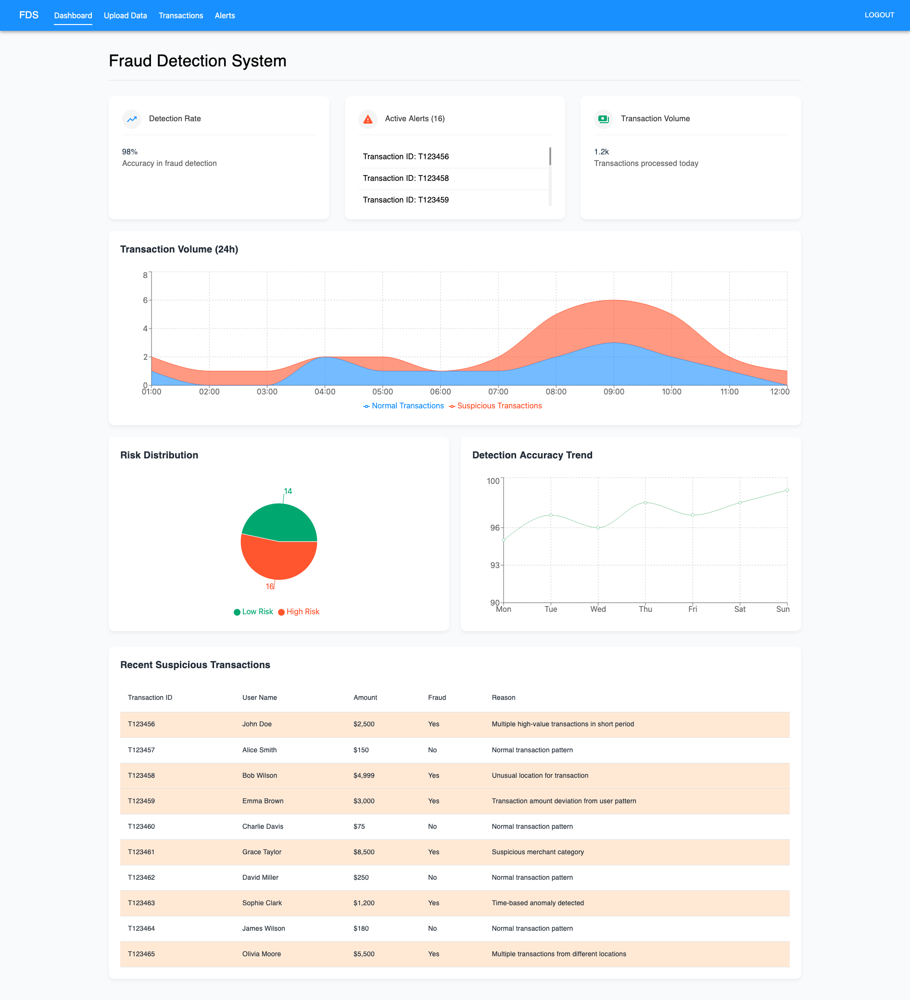

# Fraud Detection System 🛡️

A modern, real-time fraud detection system designed to help businesses identify and prevent fraudulent transactions through advanced analytics and machine learning.

## 📸 Demo

### Landing page

### More About

### Dashboard Overview

## 🚀 Features

- Real-time transaction monitoring
- Risk level assessment
- Advanced analytics dashboard
- Customizable alert system
- CSV data upload support
- Historical transaction analysis
- Trend visualization
- Alert management workflow
